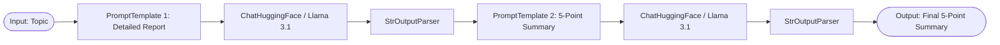
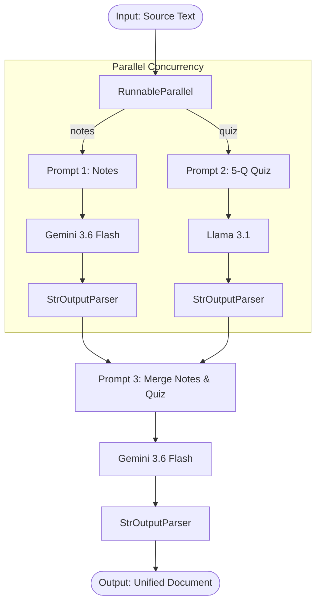
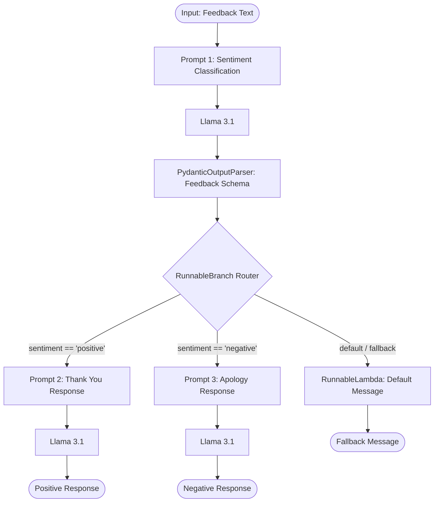

# 🔗 LangChain Chains & LCEL (LangChain Expression Language)

Welcome to the **LangChain Chains** module! This repository section demonstrates how to build modular, composable, and production-ready LLM pipelines using **LangChain Expression Language (LCEL)**.

---

## 📌 1. What are Chains?

In LangChain, a **Chain** is a sequence of modular components (such as prompt templates, language models, output parsers, or custom functions) linked together to form an end-to-end processing pipeline.

Instead of writing monolithic functions with complex conditional checks and manual parsing, chains allow you to express LLM workflows declaratively using the pipe operator (`|`).

### 🧱 Core Components of a Chain:
- **Prompts (`PromptTemplate`)**: Formats input variables into structured model instructions.
- **Models (`ChatGoogleGenerativeAI`, `ChatHuggingFace`)**: Process formatted prompts and output raw responses.
- **Output Parsers (`StrOutputParser`, `PydanticOutputParser`)**: Extract and structure raw outputs into standard strings, JSON, or Pydantic schemas.
- **Runnables (`RunnableParallel`, `RunnableBranch`, `RunnableLambda`)**: Control flow execution (concurrency, branching, custom transformation).

---

## 💡 2. Why Use Chains & Their Benefits

Using LCEL and Chains offers several architectural advantages:

| Benefit | Description |
|---|---|
| **Declarative Syntax (`|`)** | Express workflows cleanly without nested function calls or boilerplate glue code. |
| **Unified Runnable Interface** | Every chain automatically gains standard methods: `.invoke()`, `.stream()`, `.batch()`, `.ainvoke()`. |
| **Optimized Concurrency** | `RunnableParallel` automatically executes independent tasks concurrently, reducing overall latency. |
| **Modularity & Reusability** | Sub-chains can be built independently and reused across multiple parent chains. |
| **Dynamic Routing** | Route inputs conditionally based on schema evaluation or upstream classifications. |
| **Type Safety & Validation** | Integrates natively with Pydantic output parsers to guarantee structured data formats. |

---

## 🔁 3. Chain Architectures & Code Examples

### A. Sequential Chains (`sequentialchain.py`)

A **Sequential Chain** executes components linearly. The output of one step is automatically passed as the input to the next step.

#### 📊 Architecture Diagram


#### 🔍 Visual Execution Flow
```text
[Input: topic]
      │
      ▼
┌──────────────────────────────────────┐
│  Prompt 1: Write detailed report     │
└──────────────────────────────────────┘
      │
      ▼
┌──────────────────────────────────────┐
│  Model 1: ChatHuggingFace (Llama 3.1)│
└──────────────────────────────────────┘
      │
      ▼
┌──────────────────────────────────────┐
│  Parser 1: StrOutputParser           │
└──────────────────────────────────────┘
      │
      ▼
┌──────────────────────────────────────┐
│  Prompt 2: Summarize report (5 points)│
└──────────────────────────────────────┘
      │
      ▼
┌──────────────────────────────────────┐
│  Model 2: ChatHuggingFace (Llama 3.1)│
└──────────────────────────────────────┘
      │
      ▼
┌──────────────────────────────────────┐
│  Parser 2: StrOutputParser           │
└──────────────────────────────────────┘
      │
      ▼
[Output: Final Summary]
```

#### 💻 Code Example ([`sequentialchain.py`](file:///e:/Musa-Files/Desktop/langchain/langchain-chains/sequentialchain.py))
```python
template1 = PromptTemplate(
    template='write detailed report on {topic}',
    input_variables=['topic']
)

template2 = PromptTemplate(
    template='write a 5 pionter summary on {text}',
    input_variables=['text']
)

parser = StrOutputParser()

# Sequential composition using LCEL pipe operator
chain = template1 | model | parser | template2 | model | parser

response = chain.invoke({'topic': 'rise of ai in tech industry'})
```

---

### B. Parallel Chains (`parallelchains.py`)

A **Parallel Chain** uses `RunnableParallel` to run multiple independent chains concurrently. The outputs of all parallel branches are gathered into a dictionary and fed into a downstream synthesis prompt.

#### 📊 Architecture Diagram


#### 🔍 Visual Execution Flow
```text
                      ┌──> [Prompt 1: Notes] ──> [Gemini 3.6 Flash] ──> [Parser] ──┐
                      │                                                           │
[Input Text] ─────────┤                                                           ├─> [Merge Prompt] ──> [Gemini] ──> [Output]
                      │                                                           │
                      └──> [Prompt 2: Quiz]  ──> [Llama 3.1 8B]     ──> [Parser] ──┘
```

#### 💻 Code Example ([`parallelchains.py`](file:///e:/Musa-Files/Desktop/langchain/langchain-chains/parallelchains.py))
```python
# Define parallel branches
parallelchain = RunnableParallel({
    'notes': prompt1 | model1 | parser,
    'quiz':  prompt2 | model2 | parser
})

# Merge branch outputs into a final document
merge = prompt3 | model1 | parser
chain = parallelchain | merge

response = chain.invoke({'text': text_data})
```

---

### C. Conditional Chains (`conditional_chains.py`)

A **Conditional Chain** (or Branching Chain) uses `RunnableBranch` to dynamically route inputs to different downstream chains based on evaluation rules or prior classification steps.

#### 📊 Architecture Diagram


#### 🔍 Visual Execution Flow
```text
[Feedback Input] ──> [Sentiment Classifier] ──> [Pydantic Parser]
                                                       │
                                                       ▼
                                             ┌──────────────────┐
                                             │ RunnableBranch   │
                                             └────────┬─────────┘
                                                      │
                       ┌──────────────────────────────┼──────────────────────────────┐
                       ▼                              ▼                              ▼
            [Condition 1: Positive]        [Condition 2: Negative]              [Fallback]
                       │                              │                              │
                       ▼                              ▼                              ▼
            [Prompt 2: Thank You]          [Prompt 3: Apology]               [Lambda Message]
                       │                              │                              │
                       ▼                              ▼                              ▼
             [Positive Response]            [Negative Response]             [Fallback Response]
```

#### 💻 Code Example ([`conditional_chains.py`](file:///e:/Musa-Files/Desktop/langchain/langchain-chains/conditional_chains.py))
```python
class Feedback(BaseModel):
    sentiment: Literal['positive', 'negative'] = Field(description='sentiment of the feedback')

parser = PydanticOutputParser(pydantic_object=Feedback)

# Step 1: Classify sentiment into Pydantic model
classification_chain = template1 | model | parser

# Step 2: Define branch routing based on structured output
branch_chain = RunnableBranch(
    (lambda x: x.sentiment == 'positive', prompt2 | model | StrOutputParser()),
    (lambda x: x.sentiment == 'negative', prompt3 | model | StrOutputParser()),
    RunnableLambda(lambda x: "Sentiment could not be found")
)

# Combined conditional pipeline
full_chain = classification_chain | branch_chain

response = full_chain.invoke({'feedback_text': "S24 is a terrible smartphone"})
```

---

## 📁 4. Files Directory Overview

| File Name | Description | Main Technique |
|---|---|---|
| [`sequentialchain.py`](file:///e:/Musa-Files/Desktop/langchain/langchain-chains/sequentialchain.py) | Linear pipe chaining topic report generation to summary generation | Pipe operator (`\|`) |
| [`parallelchains.py`](file:///e:/Musa-Files/Desktop/langchain/langchain-chains/parallelchains.py) | Multi-model parallel execution (Gemini + Llama) for notes & quiz creation | `RunnableParallel` |
| [`conditional_chains.py`](file:///e:/Musa-Files/Desktop/langchain/langchain-chains/conditional_chains.py) | Sentiment-driven dynamic routing pipeline with Pydantic parsing | `RunnableBranch` & `PydanticOutputParser` |
| [`.env.example`](file:///e:/Musa-Files/Desktop/langchain/langchain-chains/.env.example) | Template for API keys (`GOOGLE_API_KEY`, `HUGGINGFACEHUB_API_TOKEN`) | Configuration |

---

## 🚀 How to Run

1. Make sure your `.env` file is set up with valid API tokens:
   ```env
   HUGGINGFACEHUB_API_TOKEN=your_hf_token_here
   GOOGLE_API_KEY=your_google_api_key_here
   ```
2. Run any of the chain scripts from the project root:
   ```bash
   python langchain-chains/sequentialchain.py
   python langchain-chains/parallelchains.py
   python langchain-chains/conditional_chains.py
   ```
