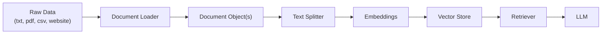

# LangChain Document Loaders  
  
This module covers **Document Loaders** — one of the foundational components used when building RAG (Retrieval-Augmented Generation) based applications.  
  
---  
  
## Where Document Loaders Fit in a RAG Application  
  
A typical RAG pipeline follows this sequence:  
  

  
**Document Loaders are the very first component in this chain.** Before an LLM can answer questions based on your own data, that data — whether it's a `.txt` file, a PDF, a CSV, or an entire webpage — has to be pulled into your application and converted into a format LangChain can work with. That's exactly what a Document Loader does.  
  
---  
  
## What Is a Document Loader?  
  
A **Document Loader** is a LangChain component responsible for reading data from a source (a file, a folder, a website, a database, etc.) and converting it into a standardized format that the rest of the LangChain ecosystem understands.  
  
**Every document loader, regardless of what kind of source it reads from, returns a list of `Document` objects.**  
  
This is the key design principle: whether you're loading a plain `.txt` file, a PDF, a CSV, or scraping a website, LangChain converts all of that different, messy, format-specific data into the **same common structure** — a list of `Document` objects. This uniformity is what allows every downstream component (text splitters, embeddings, retrievers) to work with data from *any* source without needing to know or care what that original source was.  
  
---  
  
## What Is a Document Object?  
  
The `Document` object is LangChain's **standardized container for a piece of content**, no matter where that content originally came from.  
  
No matter which loader you use — `TextLoader`, `PyPDFLoader`, `WebBaseLoader`, `CSVLoader`, or any other — the data gets converted into this same common object. A `Document` object has exactly two components:  
  
| Attribute | Description |  
|---|---|  
| `page_content` | The actual text content extracted from the source |  
| `metadata` | A dictionary of extra information about that content (e.g., source file name, page number, URL) |  
  
```python  
Document(  
    page_content="The actual text goes here...",  
    metadata={"source": "clean.txt"}  
)  
```  
  
This is why, regardless of which loader you use throughout this module, you'll always access content the same way: `doc.page_content` and `doc.metadata`.  
  
---  
  
## TextLoader  
  
**What it does:** `TextLoader` reads plain text from a `.txt` file and converts it into a LangChain `Document` object.  
  
```python  
from langchain_community.document_loaders import TextLoader  
  
loader = TextLoader('clean.txt', encoding='utf-8')  
docs = loader.load()  
  
print("Number of documents:", len(docs))  
print(docs[0].page_content)  
print(docs[0].metadata)  
```  
  
Since a `.txt` file is just one continuous block of text, `TextLoader` returns a list containing **exactly one `Document` object**, with `page_content` holding the entire file's text and `metadata` containing the file path under `source`.  
  
---  
  
## PyPDFLoader  
  
**What it does:** `PyPDFLoader` reads PDF files and converts them into a list of `Document` objects. It uses the **`pypdf` Python library under the hood** to handle the actual PDF parsing and text extraction.  
  
```python  
from langchain_community.document_loaders import PyPDFLoader  
  
loader = PyPDFLoader("artificial_intelligence.pdf")  
docs = loader.load()  
  
print("Number of documents:", len(docs))  
  
for i, doc in enumerate(docs):  
    print(f"--- Page {i+1} ---")  
    print(doc.page_content)  
    print(doc.metadata)  
```  
  
**Important behavior:** unlike `TextLoader`, which returns a single `Document` for the whole file, `PyPDFLoader` converts **every page of the PDF into its own separate `Document` object**. So a 3-page PDF will return a list of 3 `Document` objects — `docs[0]` for page 1, `docs[1]` for page 2, `docs[2]` for page 3 — each with its own `page_content` and `metadata` (including the page number).  
  
### Limitation of PyPDFLoader  
  
`PyPDFLoader` works best only on **textual PDFs** — PDFs where the content is actual selectable/extractable text (like a Word document exported to PDF).  
  
It does **not** perform well on:  
- **PDFs containing images** — since `pypdf` extracts text directly from the PDF's internal structure, it cannot read text that only exists as pixels inside an image (e.g., a scanned document). For that, you'd need an OCR-based loader instead.  
- **PDFs with tabular/structured data** — tables often get extracted as jumbled, poorly-formatted text, since `pypdf` doesn't understand table structure; it just reads text in the order it appears in the PDF's internal layout.  
  
For these cases, other specialized PDF loaders exist (e.g., OCR-based loaders for scanned/image PDFs, or table-aware loaders like those built on `pdfplumber` for structured/tabular PDFs).  
  
---  
  
## DirectoryLoader  
  
**What it does:** `DirectoryLoader` lets you load **multiple files from an entire folder at once**, instead of loading each file individually with its own loader call. You specify which loader to use internally, and it applies that loader to every matching file in the directory.  
  
```python  
from langchain_community.document_loaders import DirectoryLoader, PyPDFLoader  
  
loader = DirectoryLoader(  
    'my_pdfs/',  
    glob='*.pdf',  
    loader_cls=PyPDFLoader  
)  
  
docs = loader.load()  
  
print("Total documents loaded:", len(docs))  
```  
  
- `glob='*.pdf'` tells it to only pick up files matching that pattern (you could use `*.txt` for text files instead, etc.).  
- `loader_cls` specifies which loader class to actually use on each matched file.  
  
This is essentially a convenience wrapper that loops through a folder and applies the loader of your choice to every matching file, combining all resulting `Document` objects into a single list.  
  
---  
  
## Lazy Loading vs. `load()`  
  
By default, calling `.load()` reads the **entire** source (a large PDF, a big folder of files, etc.) into memory all at once, as a complete list of `Document` objects. For small files, this is fine — but for very large documents or huge folders, loading everything into RAM at once can be slow or memory-intensive.  
  
This is where **lazy loading** comes in.  
  
**What lazy loading does:** instead of loading everything into memory immediately, lazy loading fetches and loads data **on demand** — one piece at a time — processes it, and then removes it from memory before moving to the next piece. This means at any given moment, only a small portion of the total data is actually held in RAM.  
  
```python  
loader = PyPDFLoader("large_document.pdf")  
  
for doc in loader.lazy_load():  
    print(doc.page_content)  
    # process one page at a time; memory is freed after each iteration  
```  
  
**Key characteristics:**  
- **Use case:** best suited for **large documents** or large collections of files, where loading everything into memory at once would be inefficient or impractical.  
- **Return type:** `lazy_load()` returns a **generator** of `Document` objects, not a list. This means the documents aren't all created upfront — they're produced one at a time, only as you iterate over them.  
- Because it's a generator, you can only iterate through it once (unlike a list, which you can loop through multiple times); if you need to reuse the documents, you'd need to store them in a list yourself as you go.  
  
**Summary — `load()` vs. `lazy_load()`:**  
  
| | `load()` | `lazy_load()` |  
|---|---|---|  
| Returns | A list of `Document` objects | A generator of `Document` objects |  
| Memory usage | Loads everything into RAM at once | Loads and processes one item at a time |  
| Best for | Small files/folders | Large documents or large collections of files |  
  
---  
  
## WebBaseLoader  
  
**What it does:** `WebBaseLoader` fetches the content of a webpage and converts it into a `Document` object, making it possible to use live website content as a data source for your application.  
  
Under the hood, it uses `requests` to fetch the raw HTML of the page and `BeautifulSoup` to parse and extract readable text from that HTML.  
  
```python  
from langchain_community.document_loaders import WebBaseLoader  
  
loader = WebBaseLoader("https://example.com")  
docs = loader.load()  
  
print(docs[0].page_content)  
print(docs[0].metadata)  
```  
  
**Required installs:**  
```  
pip install requests beautifulsoup4  
```  
  
You can also pass multiple URLs at once, and it will return a `Document` object for each page:  
  
```python  
loader = WebBaseLoader([  
    "https://example.com",  
    "https://example.org"  
])  
  
docs = loader.load()  
print("Number of documents:", len(docs))  
```  
  
This is especially useful for building RAG applications that need to answer questions based on live documentation, blog posts, or any other web-hosted content, without manually copying and pasting text.  
  
### Limitation of WebBaseLoader  
  
`WebBaseLoader` works best on **static web pages** — pages where the HTML returned by the server already contains the full visible content.  
  
It does **not** perform well on:  
- **Dynamic / JavaScript-rendered pages** — since `WebBaseLoader` relies on `requests` to fetch raw HTML, it only sees the page's initial server-rendered HTML. If a page loads its actual content dynamically via JavaScript after the page loads (common in modern single-page apps built with React, Vue, etc.), that content won't be present in the raw HTML `requests` receives, so `WebBaseLoader` will return incomplete or empty content.  
  
For dynamic, JavaScript-heavy websites, other web loaders are used instead — ones that render the page in an actual browser environment (e.g., loaders built on Selenium or Playwright) before extracting the fully-rendered content.  
  
---  
  
## CSVLoader  
  
**What it does:** `CSVLoader` reads a CSV file and converts it into a list of `Document` objects — but with an important distinction: **each row of the CSV becomes its own separate `Document` object**, not the entire file as one block.  
  
```python  
from langchain_community.document_loaders.csv_loader import CSVLoader  
  
loader = CSVLoader(file_path='data.csv')  
docs = loader.load()  
  
print("Number of documents:", len(docs))  
print(docs[0].page_content)  
print(docs[0].metadata)  
```  
  
Each `Document`'s `page_content` typically contains the row's data formatted as `column_name: value` pairs (one per line), while `metadata` includes details like the source file and the row number — making it easy to trace any piece of content back to its exact row in the original spreadsheet.  
  
This row-per-document behavior is useful in RAG applications working with structured/tabular data — like FAQs, product catalogs, or logs stored in CSV format — where each row represents a distinct, independently meaningful unit of information.  
  
---  
  
## Summary Table  
  
| Loader | Source Type | Documents Returned | Notes |  
|---|---|---|---|  
| `TextLoader` | `.txt` file | 1 document for the whole file | Simplest loader |  
| `PyPDFLoader` | `.pdf` file | 1 document per page | Best for textual PDFs only; struggles with images/tables |  
| `DirectoryLoader` | Folder of files | Combines documents from all matched files | Wraps another loader class internally |  
| `WebBaseLoader` | Webpage(s) | 1 document per URL | Uses `requests` + `BeautifulSoup` internally |  
| `CSVLoader` | `.csv` file | 1 document per row | Great for structured/tabular data |  
  
**Loading strategy:**  
- Use `.load()` for small files — simple, returns a full list immediately.  
- Use `.lazy_load()` for large documents or large folders — returns a generator, processing one document at a time to keep memory usage low.  
  
---  
  
## Key Takeaway  
  
No matter which loader you use — `TextLoader`, `PyPDFLoader`, `DirectoryLoader`, `WebBaseLoader`, or `CSVLoader` — the end result is always the same standardized structure: **a list (or generator) of `Document` objects**, each with `page_content` and `metadata`. This consistency is what makes it possible to plug any data source into the same downstream RAG pipeline (text splitting, embedding, retrieval) without writing custom logic for every file type.
