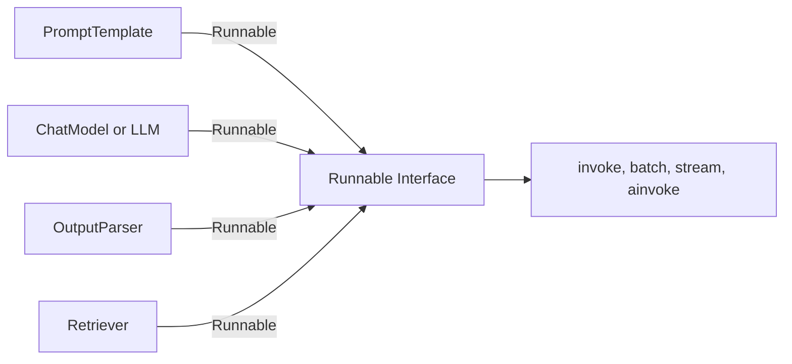
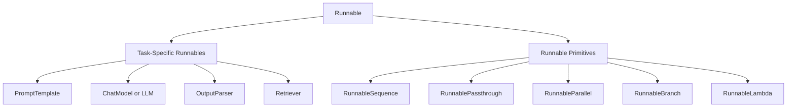

# LangChain Runnables

This module explains one of the most important architectural concepts in LangChain: **Runnables** — what they are, why they exist, and the different types you'll work with when building chains.

---

## Why Do Runnables Exist?

In early LangChain, different components — prompts, models, parsers, retrievers — each had their own separate interface. A prompt template had its own methods, an LLM had different ones, an output parser had yet another set. This made it hard to connect components together in a predictable, uniform way. If you wanted to swap one component for another, or chain them together, you constantly had to work around mismatched interfaces.

The LangChain team solved this by **standardizing every component around a single common interface** — so that no matter what the component actually does internally (call an LLM, format a prompt, parse text, query a vector store), it exposes the *same* set of methods (`invoke`, `batch`, `stream`, `ainvoke`, etc.) and can be connected to any other component seamlessly.

This common interface is called **`Runnable`**.

**The core idea:** every building block in LangChain — prompts, chat models, LLMs, output parsers, retrievers, and even entire chains — inherits from the `Runnable` base class. Because they all share the same interface, they can be plugged into each other, piped together, run in parallel, or swapped out freely, without needing custom glue code between them.



---

## What Is a Runnable?

A **Runnable** is a standard, unified interface that any component can implement to be composable within LangChain. If something is a Runnable, it guarantees it supports the same core methods:

- `invoke()` — run the component on a single input
- `batch()` — run it on multiple inputs at once
- `stream()` — get output incrementally as it's generated
- `ainvoke()` / `abatch()` / `astream()` — async versions of the above

Because every component honors this same contract, you can connect them using the pipe operator (`|`), and LangChain knows exactly how to pass output from one straight into the input of the next — regardless of what each component actually does under the hood.

**Chains are Runnables too.** When you write something like:

```python
chain = prompt | model | parser
```

You're not creating some special new "chain" object with its own separate behavior — you're creating a **Runnable instance** built by composing other Runnables together. The resulting `chain` object itself also behaves like a single Runnable — it has `.invoke()`, `.batch()`, `.stream()`, etc. — which means chains can be nested inside other chains, since a chain of Runnables is, itself, just another Runnable.

This is the elegance of the design: **everything is a Runnable, including things made of other Runnables.**

---

## Two Types of Runnables

LangChain's Runnables fall into two broad categories:



### 1. Task-Specific Runnables

These are the actual **building blocks that do meaningful work** — each one wraps a specific piece of functionality (calling a model, formatting a prompt, parsing output, retrieving documents) and exposes it through the standard Runnable interface.

Examples:
- `PromptTemplate` — formats a prompt from input variables
- `ChatModel` / `LLM` — sends input to a language model and returns a response
- `OutputParser` — converts raw model output into a structured/parsed format
- `Retriever` — fetches relevant documents from a data source

These are the pieces you're actually trying to accomplish something with. They do the "real" task.

### 2. Runnable Primitives

These are **structural/orchestration tools** — they don't do a task themselves, but control *how* other Runnables are composed and executed: in sequence, in parallel, conditionally, or through custom logic.

Think of primitives as the "glue" and "control flow" of your pipeline — they define the *shape* of execution, while task-specific Runnables define the *content* of execution.

---

## The Runnable Primitives, Explained

### RunnableSequence

**What it does:** Chains Runnables together so the output of one becomes the input of the next, executed strictly in order.

**This is what the pipe operator (`|`) actually builds under the hood.** When you write:

```python
chain = prompt | model | parser
```

LangChain is constructing a `RunnableSequence` behind the scenes — `prompt`'s output flows into `model`, and `model`'s output flows into `parser`.

```python
from langchain_core.runnables import RunnableSequence

chain = RunnableSequence(prompt, model, parser)
```

**Use when:** you need a straightforward, linear pipeline — step 1 → step 2 → step 3.

---

### RunnablePassthrough

**What it does:** Passes its input straight through, unchanged, as its output. It's essentially a no-op Runnable.

**Why it's useful:** Sometimes you need to preserve the original input alongside a transformed value, especially inside a `RunnableParallel` — one branch transforms the data, while another branch (using `RunnablePassthrough`) just carries the original input forward untouched, so both are available downstream.

```python
from langchain_core.runnables import RunnablePassthrough, RunnableParallel

chain = RunnableParallel({
    'original': RunnablePassthrough(),
    'upper': RunnableLambda(lambda x: x.upper())
})

chain.invoke("hello")
# {'original': 'hello', 'upper': 'HELLO'}
```

**Use when:** you need to retain the raw/original input value further down the pipeline instead of losing it after a transformation.

---

### RunnableParallel

**What it does:** Runs multiple Runnables **simultaneously** on the same (or differently-keyed) input, and returns a dictionary combining all their outputs.

```python
from langchain_core.runnables import RunnableParallel

chain = RunnableParallel({
    'notes': prompt1 | model1 | parser,
    'quiz': prompt2 | model2 | parser
})

result = chain.invoke({'topic': text})
# {'notes': "...", 'quiz': "..."}
```

By default, every branch inside a `RunnableParallel` receives the **entire same input** — each branch's own prompt/logic simply pulls out whichever key(s) it needs.

**Use when:** you want to generate multiple independent outputs from the same input at the same time (e.g., generating notes and a quiz from the same topic simultaneously), rather than running them one after another.

---

### RunnableBranch

**What it does:** Adds **conditional routing** — it evaluates a series of condition functions and executes the Runnable tied to the first condition that returns `True`. If none match, it falls back to a default Runnable.

```python
from langchain_core.runnables import RunnableBranch

chain = RunnableBranch(
    (lambda x: len(x['text']) > 500, long_text_chain),
    (lambda x: len(x['text']) <= 500, short_text_chain),
    default_chain
)
```

**Use when:** your pipeline needs to behave differently depending on the input — essentially the Runnable equivalent of an if/elif/else statement.

---

### RunnableLambda

**What it does:** Wraps any plain Python function so it becomes a Runnable — letting you inject custom logic anywhere in a chain.

```python
from langchain_core.runnables import RunnableLambda

to_upper = RunnableLambda(lambda x: x.upper())

chain = prompt | model | parser | to_upper
```

**Use when:** you need custom transformation, preprocessing, or postprocessing logic that doesn't already exist as a built-in LangChain component — it's your escape hatch for arbitrary code inside a Runnable pipeline.

---

## Quick Reference: Runnable Primitives

| Primitive | Purpose | Analogy |
|---|---|---|
| `RunnableSequence` | Run steps one after another | A pipeline / assembly line |
| `RunnablePassthrough` | Pass input through unchanged | A pass-through wire |
| `RunnableParallel` | Run multiple steps at the same time | Parallel workers |
| `RunnableBranch` | Choose a path based on a condition | if / elif / else |
| `RunnableLambda` | Run custom Python logic | A custom function plugged in |

---

## What Is LCEL?

**LCEL (LangChain Expression Language)** is the declarative syntax that lets you build these Runnable pipelines using the **pipe operator (`|`)**, instead of manually instantiating `RunnableSequence`, `RunnableParallel`, etc.

```python
chain = prompt | model | parser
```

Under the hood, this line of LCEL code is just shorthand for building a `RunnableSequence` out of `prompt`, `model`, and `parser` — three Runnables composed together.

**Why LCEL matters:**
- **Readability** — pipelines read top-to-bottom, left-to-right, mirroring the actual flow of data.
- **Composability** — because every component is a Runnable, LCEL lets you freely combine task-specific Runnables and Runnable primitives into arbitrarily complex pipelines using the same simple syntax.
- **Built-in support** — chains built with LCEL automatically get `.invoke()`, `.batch()`, `.stream()`, async variants, and other Runnable-interface features for free, without extra setup.

In short: **Runnables are the standardized building blocks, and LCEL is the syntax that lets you snap them together.** This combination is what makes LangChain pipelines both flexible (you can plug in almost anything) and simple to read/write (thanks to the `|` operator).

---

## Summary

- LangChain standardized every component — prompts, models, parsers, retrievers, and even entire chains — around a single common interface called **`Runnable`**, so they can all connect to each other seamlessly.
- Runnables fall into two categories: **task-specific Runnables** (the actual work: prompts, models, parsers, retrievers) and **Runnable primitives** (the orchestration/control-flow tools: sequence, passthrough, parallel, branch, lambda).
- **`RunnableSequence`** runs steps in order, **`RunnablePassthrough`** forwards input unchanged, **`RunnableParallel`** runs steps simultaneously, **`RunnableBranch`** adds conditional routing, and **`RunnableLambda`** lets you inject custom Python logic.
- **LCEL** is the pipe-based (`|`) syntax that lets you compose all of these Runnables together declaratively — and because chains built this way are themselves Runnables, they can be nested and reused just like any other component.
