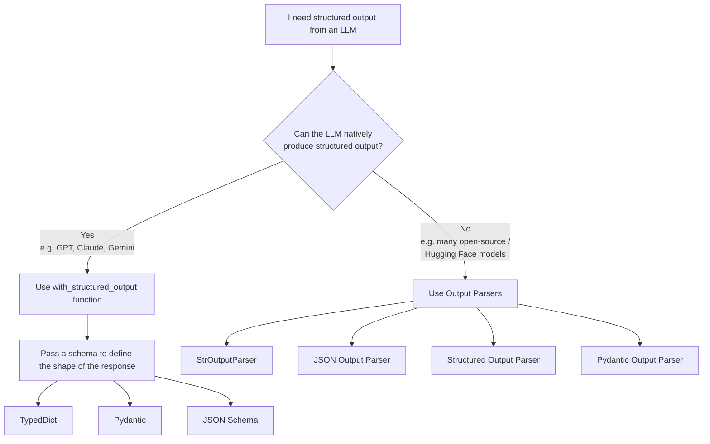
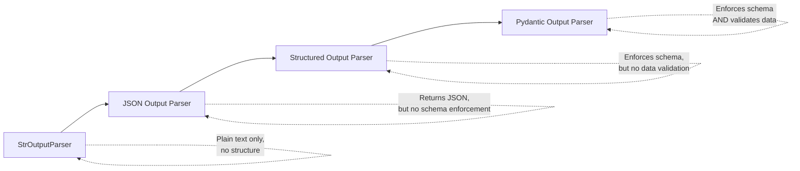
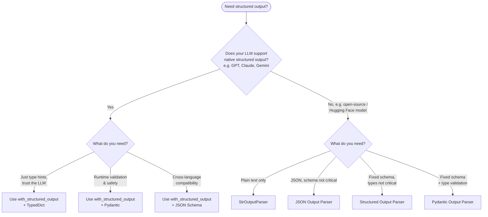

# LangChain Structured Output

This module demonstrates how to get **predictable, machine-readable output** from LLMs using LangChain — instead of relying on free-form text that's hard to parse programmatically.

---

## What is Structured Output?

By default, an LLM returns a plain string. That's great for chat, but useless when your code needs to *do* something with the response — save it to a database, call an API, or trigger logic based on a specific field.

**Structured output** means constraining the LLM's response to a predefined schema (e.g., a fixed set of fields with specific types) so the output is always predictable and directly usable by other code — no manual parsing, no guesswork, no regex.

## Why It Matters

Structured output is what makes it possible to connect an LLM to other machines and systems. An LLM that only produces prose can't reliably talk to a database, a UI, or another program — but one that returns clean JSON or a validated object can be plugged directly into any pipeline.

This unlocks three major use cases:

| Use Case | Description |
|---|---|
| **Data Extraction** | Pull specific fields (name, sentiment, date, amount, etc.) out of unstructured text like reviews, emails, or documents |
| **API Building** | Return consistent JSON responses from an LLM-powered endpoint that a frontend or another service can consume directly |
| **Agents** | Let an LLM decide *which* action to take and *what arguments* to pass, in a structured format the agent's execution logic can act on |

---

## Two Categories of LLMs

Not all LLMs support structured output the same way. This changes which tool you reach for.



- **LLMs that natively support structured output** — closed-source, function-calling-capable models like **GPT (OpenAI)**, **Claude (Anthropic)**, and **Gemini (Google)**. These models were trained/fine-tuned to reliably return output in a schema you define. For these, LangChain provides the `with_structured_output()` function.
- **LLMs that cannot natively produce structured output** — many open-source models (including a lot of Hugging Face models) lack reliable native support for schema-constrained output. For these, LangChain provides **Output Parsers**, which work by adding formatting instructions to the prompt and then parsing the raw text response afterward.

---

## Path 1: `with_structured_output()` — For LLMs That Support It

When your model supports structured output natively, you use `with_structured_output()` and pass it a schema. LangChain supports **three ways** to define that schema:

### 1. TypedDict

```python
from typing_extensions import TypedDict

class Review(TypedDict):
    summary: str
    sentiment: str
```

**Use when:** you trust the LLM's output and just want type hints for your own code readability/IDE support. TypedDict provides **no runtime validation** — it's purely a hint for you and your editor, not a guarantee enforced at execution time.

### 2. Pydantic

```python
from pydantic import BaseModel, Field

class Review(BaseModel):
    summary: str = Field(description="A brief summary of the review")
    sentiment: str = Field(description="Return sentiment: pos or neg")
```

**Use when:** you need **data validation and safety checks**. Pydantic actually validates the response at runtime — if the LLM returns a string where an integer was expected, Pydantic will raise a validation error (or coerce it, depending on config) instead of silently letting bad data through. This is the safest option when correctness matters.

### 3. JSON Schema

```python
json_schema = {
    "title": "Review",
    "type": "object",
    "properties": {
        "summary": {"type": "string", "description": "A brief summary of the review"},
        "sentiment": {"type": "string", "enum": ["pos", "neg"]}
    },
    "required": ["summary", "sentiment"]
}
```

**Use when:** you need **cross-language / cross-system compatibility**. JSON Schema isn't tied to Python — it's a language-agnostic, universally understood format. This matters when the schema needs to be shared with or consumed by non-Python systems (a JS frontend, a different backend service, an API contract, etc.).

### When to Use What?

| Feature | TypedDict | Pydantic | JSON Schema |
|---|:---:|:---:|:---:|
| Basic structure | ✅ | ✅ | ✅ |
| Type enforcement | ✅ | ✅ | ✅ |
| Data validation | ❌ | ✅ | ❌ |
| Default values | ❌ | ✅ | ❌ |
| Automatic conversion | ❌ | ✅ | ❌ |
| Cross-language compatibility | ❌ | ❌ | ✅ |

---

## Path 2: Output Parsers — For LLMs That Don't Support It

If a model can't reliably produce structured output on its own (common with many open-source / Hugging Face models), LangChain provides **Output Parsers**. These work by injecting formatting instructions into the prompt, then parsing the raw text response into a structured form after the fact.

There are four main output parsers, and they exist on a spectrum of increasing strictness:



### 1. `StrOutputParser`

**What it does:** Extracts plain text from the LLM's response — essentially `response.content` — nothing more.

**Use when:** you just want simple plain text output, and don't need any structure. Its real value is that it lets you cleanly plug the output into other LangChain components, like chains (`prompt | model | StrOutputParser()`), instead of manually pulling `.content` off the response object every time.

### 2. `JSON Output Parser`

**What it does:** Instructs the LLM to return valid JSON and parses it into a Python dict.

**Flaw:** You cannot enforce a specific schema. The LLM can return *any* valid JSON structure — extra fields, missing fields, wrong nesting — as long as it's syntactically valid JSON. There's no guarantee it matches the shape you actually wanted.

### 3. `Structured Output Parser`

**What it does:** Solves the JSON parser's flaw by letting you define the exact fields/schema you expect, and enforces that shape in the formatting instructions sent to the LLM.

**Flaw:** While it enforces the *schema* (field names/structure), it does **not perform data validation** on types. The LLM could return a string where you expected an integer, and the parser won't catch it — it only checks that the expected fields exist, not that their values are the correct type.

### 4. `Pydantic Output Parser`

**What it does:** Solves the remaining gap. It enforces both the schema **and** validates data types using Pydantic under the hood — the same validation guarantees as the Pydantic approach in `with_structured_output()`, just achieved through prompt instructions + parsing instead of native model support.

**Use when:** you're working with a model that lacks native structured output support, but you still need the reliability of proper type validation.

### Quick Comparison

| Parser | Schema Enforcement | Data Validation | Best For |
|---|---|---|---|
| StrOutputParser | ❌ No | ❌ No | Plain text, chaining components |
| JSON Output Parser | ❌ No | ❌ No | Quick JSON output, no strict shape needed |
| Structured Output Parser | ✅ Yes | ❌ No | Fixed fields, low risk of type mismatch |
| Pydantic Output Parser | ✅ Yes | ✅ Yes | Full reliability with non-native models |

---

## Decision Guide



---

## Summary

- **Structured output** turns unpredictable LLM text into reliable, machine-usable data — the foundation for data extraction, API building, and agents.
- If your LLM **natively supports** structured output (GPT, Claude, Gemini), use **`with_structured_output()`** with a schema defined via **TypedDict**, **Pydantic**, or **JSON Schema** — depending on whether you need type hints, validation, or cross-language compatibility.
- If your LLM **cannot** natively produce structured output (many open-source / Hugging Face models), use an **Output Parser** — progressing from `StrOutputParser` → `JSON Output Parser` → `Structured Output Parser` → `Pydantic Output Parser` for increasing levels of schema enforcement and data validation.
